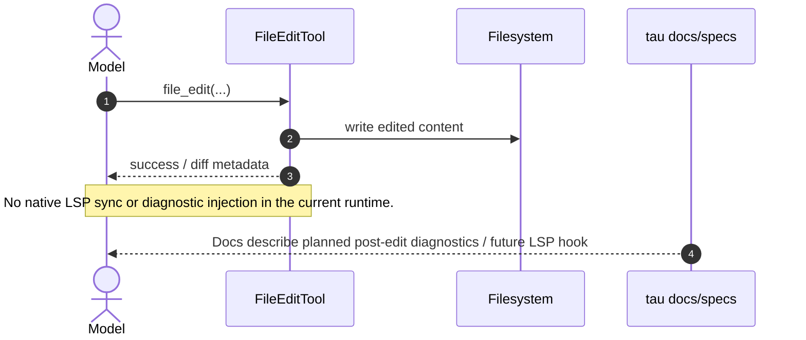
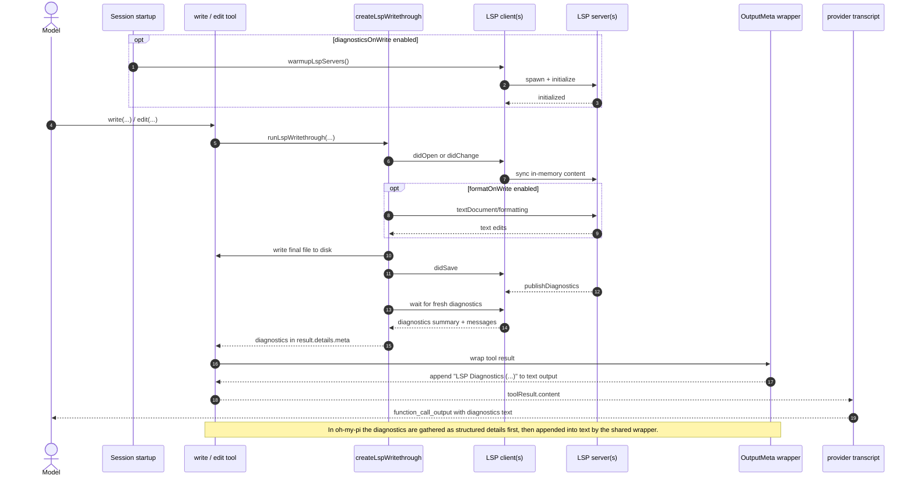
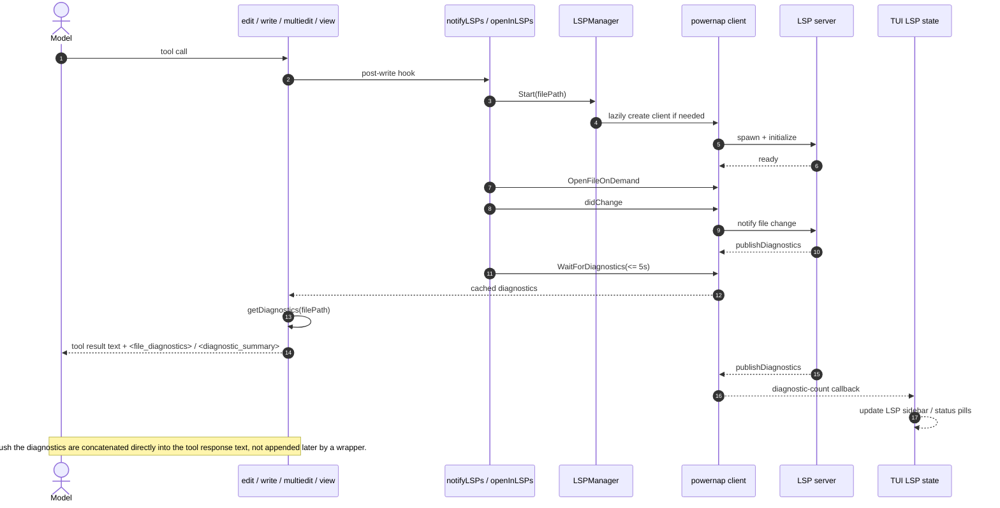

# LSP Feedback Sequence

## tau

```mermaid
sequenceDiagram
    autonumber
    actor Model
    participant FE as FileEditTool
    participant FS as Filesystem
    participant Docs as tau docs/specs

    Model->>FE: file_edit(...)
    FE->>FS: write edited content
    FE-->>Model: success / diff metadata

    Note over FE,Model: No native LSP sync or diagnostic injection in the current runtime.
    Docs-->>Model: Docs describe planned post-edit diagnostics / future LSP hook
```

## oh-my-pi

```mermaid
sequenceDiagram
    autonumber
    actor Model
    participant Session as Session startup
    participant Tool as write / edit tool
    participant WT as createLspWritethrough
    participant Client as LSP client(s)
    participant Server as LSP server(s)
    participant Meta as OutputMeta wrapper
    participant Provider as provider transcript

    opt diagnosticsOnWrite enabled
        Session->>Client: warmupLspServers()
        Client->>Server: spawn + initialize
        Server-->>Client: initialized
    end

    Model->>Tool: write(...) / edit(...)
    Tool->>WT: runLspWritethrough(...)
    WT->>Client: didOpen or didChange
    Client->>Server: sync in-memory content
    opt formatOnWrite enabled
        WT->>Server: textDocument/formatting
        Server-->>WT: text edits
    end
    WT->>Tool: write final file to disk
    WT->>Client: didSave
    Server-->>Client: publishDiagnostics
    WT->>Client: wait for fresh diagnostics
    Client-->>WT: diagnostics summary + messages
    WT-->>Tool: diagnostics in result.details.meta
    Tool->>Meta: wrap tool result
    Meta-->>Tool: append "LSP Diagnostics (...)" to text output
    Tool-->>Provider: toolResult.content
    Provider-->>Model: function_call_output with diagnostics text

    Note over Tool,Meta: In oh-my-pi the diagnostics are gathered as structured details first, then appended into text by the shared wrapper.
```

## crush

```mermaid
sequenceDiagram
    autonumber
    actor Model
    participant Tool as edit / write / multiedit / view
    participant Notify as notifyLSPs / openInLSPs
    participant Manager as LSPManager
    participant Client as powernap client
    participant Server as LSP server
    participant UI as TUI LSP state

    Model->>Tool: tool call
    Tool->>Notify: post-write hook
    Notify->>Manager: Start(filePath)
    Manager->>Client: lazily create client if needed
    Client->>Server: spawn + initialize
    Server-->>Client: ready
    Notify->>Client: OpenFileOnDemand
    Notify->>Client: didChange
    Client->>Server: notify file change
    Server-->>Client: publishDiagnostics
    Notify->>Client: WaitForDiagnostics(<= 5s)
    Client-->>Tool: cached diagnostics
    Tool->>Tool: getDiagnostics(filePath)
    Tool-->>Model: tool result text + <file_diagnostics> / <diagnostic_summary>

    Server-->>Client: publishDiagnostics
    Client-->>UI: diagnostic-count callback
    UI-->>UI: update LSP sidebar / status pills

    Note over Tool,Model: In crush the diagnostics are concatenated directly into the tool response text, not appended later by a wrapper.
```
